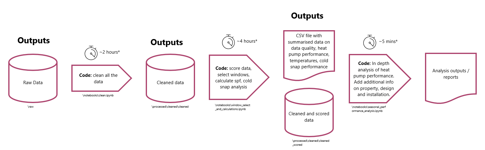
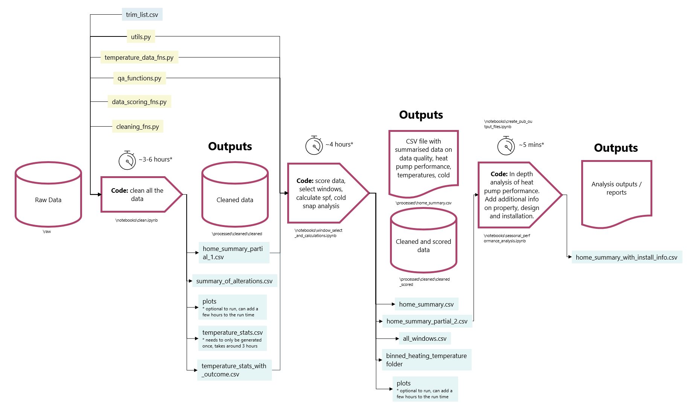

Electrification of Heat
==============================

The Electrification of Heat (EoH) demonstration project is funded by the Department for Business, Energy, and Industrial Strategy (BEIS) and seeks to better understand the feasibility of a large-scale rollout of heat pumps across the UK. It aims to demonstrate that heat pumps can be installed in a wide variety of homes and deliver high customer satisfaction across a range of customer groups.

This git repository holds notebooks which enable processing of the EoH monitoring data from its raw format through stages of cleaning, data scoring, heat pump performance calculations and analysis.

The data can be found in the UK data archives at:

raw: https://beta.ukdataservice.ac.uk/datacatalogue/doi?id=9049

clean: https://beta.ukdataservice.ac.uk/datacatalogue/doi?id=9050

The code can take several hours to process, speed will primarily be dependent on the format of the raw data and the specification of the machine being run on. Raw and cleaned versions of the data exist, in case you wish to skip cleaning the data and proceed to use the data for your own analysis.

### High level process flow



### Low level process flow



### Notes

The raw data along with various other inputs and outputs are not stored on gitlab but instead either locally (recommended) or on a shared/cloud drive.

Detail on the cleaning process can be found in [this document](reports/Cleansing.md).

To run the seasonal_performance_calculations.ipynb file, you will need a free login for the usmart platform to be able to access the dataset https://usmart.io/org/esc/dataset/view-edit?datasetGUID=6e1432df-1617-4324-b9aa-b247ba095267 which is required for the analysis. You will also need to set environment variables for your USMART_KEY_ID and USMART_KEY_SECRET, these keys can be found in your profile in usmart.

### Steps to move from raw data to analysis outputs

0.  Run the following commands to create a conda environment called EoH and to install relevant packages.

```
    conda config --add channels conda-forge
```

```
    conda env create --name EoH --file=environment.yml
```
1.  Set up environment variables for your os (USMART_LEY_ID, UMSART_KEY_SECRET, EoH). The environment variable EoH should point at the directory where the raw data is stored.
2.  Run the clean.ipynb notebook to generate the cleaned dataset
3.	Run the window_select_and_calcualtions.ipynb notebook to generate the home_summary.csv file and the cleaned_scored dataset
4.	Run the seasonal_performance_analysis.ipynb notebook to generate the analysis outputs

### Expected folder structure for local directory

An environment variable named 'EoH' within the code points to the folder which contains the EOH_Data_Local folder.

Once the EOH_Data_Local directory is created, folders will be created automatically when running the script.


| Level 0    | Level 1                     | Level 2                | Level 3                | Level 4                | Notes                                                 |
|------------|-----------------------------|------------------------|------------------------|------------------------|-------------------------------------------------------|
| processed\ | binned_heating_temperature\ | all_flow_temperatures\ |                        |                        |                                                       |
| processed\ | binned_heating_temperature\ | plots\                 | all_flow_temperatures\ |                        |                                                       |
| processed\ | cleaned\                    | cleaned\               |                        |                        | This   is where the cleaned data is stored            |
| processed\ | cleaned\                    | cleaned_scored\        |                        |                        | This   is where the cleaned and scored data is scored |
| processed\ | cleaned\                    | plots\                 | double_flagged\        | corrected\             | This   is where the main plots are stored             |
| processed\ | cleaned\                    | plots\                 | full\                  | change_point_analysis\ | This   is where the main plots are stored             |
| processed\ | cleaned\                    | plots\                 | single_flagged\        | corrected\             | This   is where the main plots are stored             |
| processed\ | cleaned\                    | plots\                 | single_flagged\        |                        | This   is where the main plots are stored             |
| processed\ | cleaned\                    | plots\                 | window\                |                        | This   is where the main plots are stored             |
| processed\ | for_publication\            | clean\                 |                        |                        | This   folder needs to be zipped for publication      |
| processed\ | for_publication\            | raw\                   |                        |                        | This   folder needs to be zipped for publication      |
| raw\       |                             |                        |                        |                        | This   is where the raw data should be stored         |